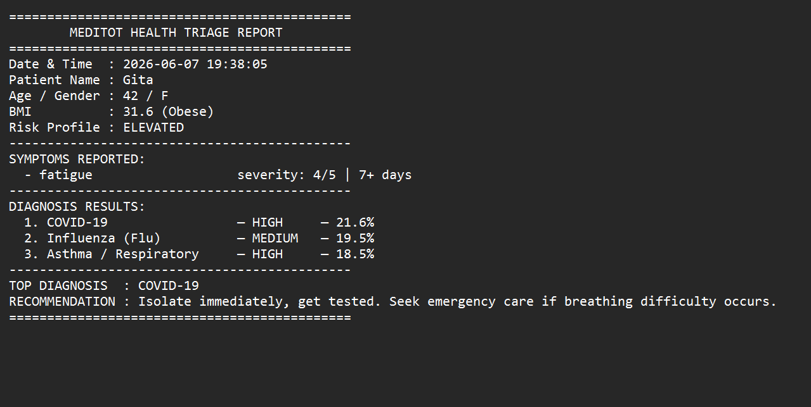

# PulseMatrix

A high-performance, deterministic C engine designed for autonomous patient triage and clinical risk stratification. The core architecture utilizes a multi-tiered evaluation pipeline that weighs acute symptom profiles against historical physiological baselines while processing heuristic edge-cases for acute systemic emergencies.

## 🛠️ System Architecture & Mechanics

The engine evaluates patient data through three isolated logical phases:

1. **Anchored Scoring Matrix:** Symptoms are mapped against a static diagnostic database. Raw weights dynamically scale using logical multipliers based on duration timelines and clinical severity scales ($1$ to $5$).
2. **Comorbidity Adjustments:** The engine alters baseline probability curves by intercepting physiological indicators—such as checking fasting blood sugar thresholds ($\ge 126 \text{ mg/dL}$) for uncontrolled diabetes or tracking systolic/diastolic metrics for hypertensive crises.
3. **Heuristic Red-Flag Interception:** Independent safety rules bypass standard scoring algorithms to flag immediate life-threatening conditions (e.g., acute radiating chest pain, thyroid storms, or hyperpyrexia $\ge 104^\circ\text{F}$).

---

## 📊 Diagnostic Engine Output Demo

When a triage session concludes, the runtime executes localized filesystem persistence, logging historical metrics to an append-only ledger (`triage_log.txt`) and exporting isolated, structured text-based diagnostic files:



---

## 💻 Technical Implementation Details

* **Memory Architecture:** Implements optimized physical data layout using ne
* sted, packed structures (`Patient`, `MedicalHistory`, `SymptomEntry`) and dynamic memory tracking via standard allocations.
* **Algorithmic Complexity:** 
  * **Symptom Collection & Processing:** $\mathcal{O}(N \cdot M)$ where $N$ is reported symptoms and $M$ is the global symptom bank.
  * **Differential Sort Execution:** Bubble-sorted matching array optimized for localized, low-overhead arrays ($\text{Count} = 10$).
* **Data Layer:** Zero external database dependencies. Built entirely on top of standard library structures (`<string.h>`, `<stdlib.h>`, `<time.h>`) ensuring compilation portability across native environments.

---

## ⚙️ Compilation & Deployment

### Compilation
Compile the translation unit using GCC. Ensure you explicitly link the standard mathematics library (`-lm`) to handle BMI and risk-scaling computations:

```bash
gcc symptom_checker_v2.c -o pulse_matrix -lm
Execution
Run the compiled binary executable to initialize the interactive Command Line Interface (CLI):

./pulse_matrix
