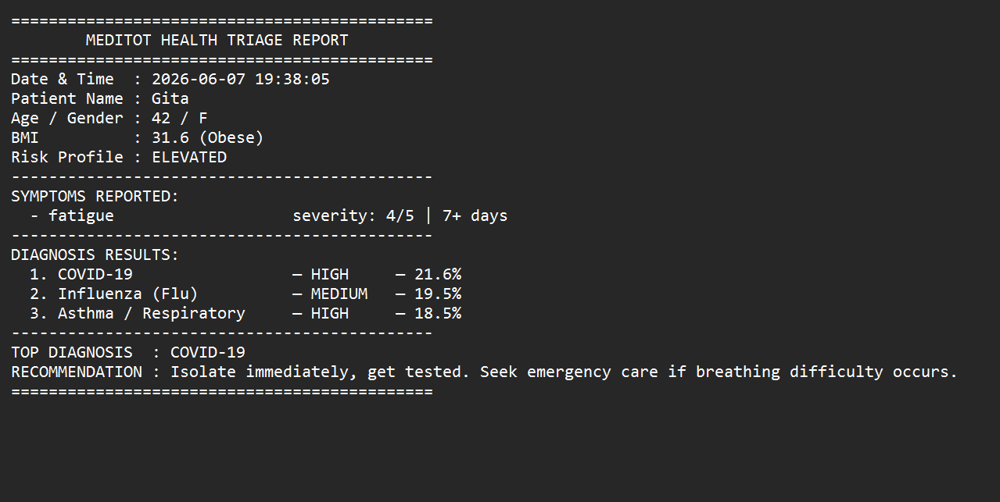
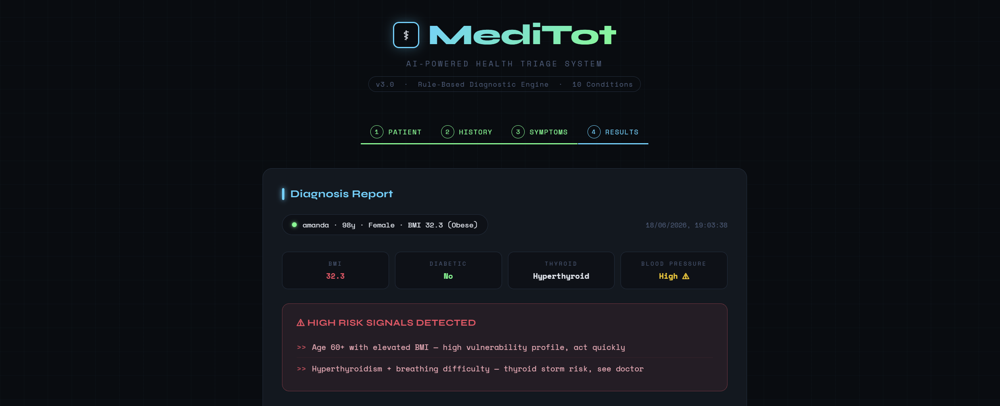
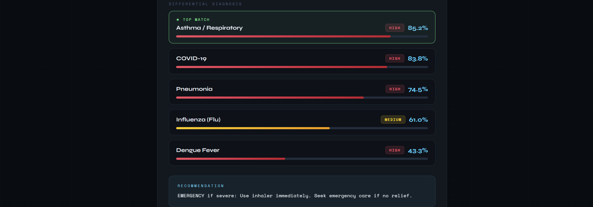
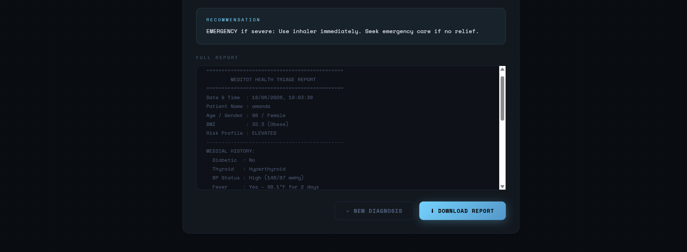

# PulseMatrix
A high-performance, deterministic C engine designed for autonomous patient triage and clinical risk stratification. The core architecture utilizes a multi-tiered evaluation pipeline that weighs acute symptom profiles against historical physiological baselines while processing heuristic edge-cases for acute systemic emergencies.

- Standalone CLI triage engine

🛠️ System Architecture & Working Mechanism

The diagnostic engine processes patient information through three independent logical stages:

Symptom-Based Scoring Matrix: Patient symptoms are matched against a predefined diagnostic knowledge base. Each symptom is assigned a base weight, which is dynamically adjusted using logical multipliers based on symptom duration and clinical severity (rated on a scale of 1–5).
Comorbidity-Based Probability Adjustment: The system refines disease likelihood by incorporating physiological indicators and existing medical conditions. For example, fasting blood glucose values ≥126 mg/dL increase the likelihood of uncontrolled diabetes, while abnormal systolic and diastolic blood pressure readings influence hypertension-related assessments.
Critical Red-Flag Detection: A separate safety layer operates independently of the scoring engine to identify medical emergencies requiring immediate attention. This includes conditions such as acute radiating chest pain, thyroid storm, and hyperpyrexia with body temperature ≥104°F (40°C), which override normal scoring and trigger urgent alerts.

## 🖥️ Application Interface Walkthrough

### 1. Patient Vitals Intake
The ingestion layer collects demographic variables to compute foundational metabolic baselines (BMI calculation) and activate age-dependent risk multipliers.

### 2. Clinical Risk Profile & Alerts
The engine parses underlying physiological comorbidities alongside acute indicators to flag compounding clinical vulnerabilities.

### 3. Differential Diagnostic Breakdown
 A prioritized matrix array sorts conditional scores to output percentage-based matching probabilities alongside immediate actionable guidelines.

### 4. File-System Logging & Export
The backend runs automated physical file serialization, mapping telemetry inputs to an append-only ledger and generating structured, local diagnostic summaries.

---

Technical Implementation DetailsMemory Architecture & Data ModelingHierarchical Struct Modeling: Organized into modular, deeply nested composite data types to model patient profiles with minimal cache misses:SymptomEntry: Stores localized symptom descriptors, severity scale metrics, and duration timestamps.MedicalHistory: Aggregates chronic conditions, historical clinical records, and allergy profiles.Patient: Acts as the root record, binding demographic identifiers, historical clinical data, and dynamic lists of current symptoms.Dynamic Allocation & Safety: Employs heap allocation via malloc() and calloc() for runtime symptom matching and candidate lists, minimizing the stack memory footprint. Explicit deallocation routines (free()) and pointer zeroing are applied to prevent memory leaks and dangling pointer dereferencing.Algorithmic Complexity & OptimizationSymptom Processing Pipeline:Matches reported patient indicators against the pre-compiled clinical repository using iterative lookup and string tokenization.Time Complexity: $\mathcal{O}(N \times M)$, where $N$ represents the count of symptoms provided by the user and $M$ is the total reference symptom set in the internal knowledge base.Space Complexity: $\mathcal{O}(N)$ dynamic working memory allocated to retain active matching candidates.Diagnosis Ranking Mechanism:Uses an in-place Bubble Sort pass to order potential matches by calculated probability and risk weighting.Time Complexity: Worst-case $\mathcal{O}(K^2)$, where $K$ is the number of candidate diagnoses. Because the candidate buffer is intentionally bounded to a strict threshold ($K \le 10$), total operations never exceed 45 comparisons, providing predictable execution times without the call-stack overhead of divide-and-conquer algorithms.Space Complexity: $\mathcal{O}(1)$ auxiliary space since candidate sorting is executed strictly in-place.Data Layer & PortabilityDependency-Free Architecture: Eliminates external runtime engines and relational database requirements by relying strictly on standard ANSI/ISO C libraries:<string.h>: Efficient byte-level memory operations, string slicing, and substring matching.<stdlib.h>: Dynamic memory management, sorting utilities, and process lifecycle routines.<time.h>: Timestamp generation for patient intake logging and audit records.<math.h>: Floating-point operations for body mass index (BMI) formulas and non-linear risk score evaluations.⚙️ Compilation & DeploymentCompilation InstructionsBuild the application binary using the standard GCC toolchain. Explicitly link the POSIX math library using the -lm flag to support numerical risk calculations, BMI modeling, and exponentiation routines.Bash# General compilation
gcc main.c -o diagnosis_system -lm

# Version-specific build target
gcc symptom_checker_v2.c -o pulse_matrix -lm
Recommended Production FlagsFor strict conformance checking and optimization during deployment:Bashgcc -Wall -Wextra -pedantic -O2 symptom_checker_v2.c -o pulse_matrix -lm
Deployment CharacteristicsStandalone Binary: Produces a lightweight, self-contained binary (<5 MB) with no runtime shared-library dependencies outside standard libc and libm.Cross-Platform Compatibility: Runs across all POSIX-compliant environments (Linux, macOS, BSD) and Windows (via MinGW, MSYS2, or WSL).
